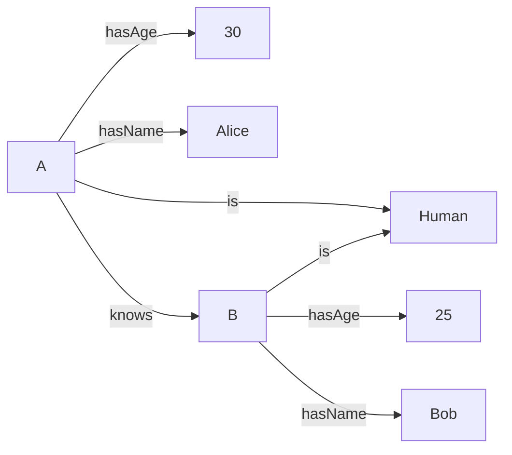
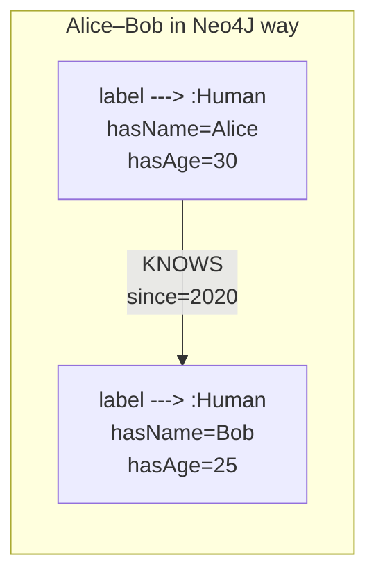

# RDF-based graph database vs Neo4J

## RDF

RDF is stand for [Resource Definition Framework](https://www.w3.org/TR/rdf-primer/). In particular it defines notion of RDF graph.
According to RDF documents RDF graphs are 'sets of subject-predicate-object triples, where elements (of each triple) may be URIs, datatype literals or blank nodes'.

We will talk more about URIs, datatype literals and blank nodes below. For now let us understand how to build graph using set of triples.

### graph as set of triples

Consider this set of triples present by CSV file given below. It has three columns. In RDF terms first column is subject, then goes predicate and object columns.

```
subject_node_id,predicate,object_node_id
A,is,Human
A,hasAge,30
A,hasName,Alice
B,is,Human
B,hasAge,25
B,hasName,Bob
A,knows,B
```

If you would imagine that each line correspond to link between *subject* and *object* nodes. The link itself labeled as *predicate*. Then you would see this graph:



RDF graphs are constructed exactly this way. Each RDF triple is to specify two nodes connected by link. Link - or predicate - is directed from subject node to object node.
Note that such graph construction is alternative to construction which often defined as sets of vertices and edges. In the case of RDF the graph is defined using only one set of triples.

### Turtle - Terse RDF Triple Language

Now let's see how to define real RDF graph. The defitions and picture above are not RDF graphs - because the way how triples are written is not compliant with RDF restrictions.
RDF specify what exactly nodes (subject/object) and links (predicate) could be:

- subject can be only URI or blank node
- predicate can be only URI
- object can be URI, blank node or datatype literal.

URIs and datatype literals are called resources - giving Resource in RDF abbreviation. Each triple says that 'some relationship, indicated by the predicate, holds between the resources denoted by the subject and object'.

To stay practical let's use [Turtle](https://en.wikipedia.org/wiki/Turtle_(syntax) language to define RDF graph which will show the same Alice-Bob relations as in previous section:

```
@prefix ex: <http://example.com/simple-example#>
ex:A ex:is ex:Human .
ex:A ex:hasAge 30 .
ex:A ex:hasName "Alice" .
ex:B ex:is ex:Human .
ex:B ex:hasAge 25 .
ex:B ex:hasName "Bob" .
<http://example.com/simple-example#A> ex:knows <http://example.com/simple-example#B> .
```

Consider last line of example above. Subject is actually URI. URI - Universal Resource Identifier -- is quite familar for many of us since URL is actually subclass of URI. I.e. any URL is actually URI. In RDF/Turtle syntax URI must be enclosed in <> brackets. So the subject URI is http://example.com/simple-example#A, object URI is http://example.com/simple-example#B.

What about **ex:knows**? This is example of compact URI sometimes called CURIE (Compact URI). CURIE is actually converted to URI during RDF/Turtle file processing. CURIE has prefix:suffix structure. To convert CURIE to URI one needs to replace prefix with prefix URI which suppose to be specified via @prefix directive. Prefix directives are to be found at the begining of RDF file.
This way CURIE ex:knows converts to URI <http://example.com/simple-example#knows>. The statement below is equivalent of last line of example:

```
<http://example.com/simple-example#A> <http://example.com/simple-example#knows> <http://example.com/simple-example#B> .
```

Now let's consider third line.
```
ex:A ex:hasAge 30 .
```

The object does not look like URI or CURIE. It is datatype literal which represent integer value 30. The same way object in fourth line is string "Alice". The double quotes are omit as custom in many programming languages so actual string has just 5 bytes: 'A', 'l', 'i', 'c', 'e'.

ALSO NOTE THAT even quite often URI looks like URL going to some website it is actully does not have to be. I.e. URI are very often just strings resembling URLs.

### a bit more about turtle

Turtle is actually most popular way to specify RDF graphs in various datasets, documents, examples. Unlike similar [RDF/XML](https://en.wikipedia.org/wiki/RDF/XML) it is even possible to quickly grasp the graph strucuture looking to turtle text - or turtle code if you like. Sometime Turtle mentioned as programming language where only asserts are allowed.

So live up to the role of programming language Turtle syntax has additional feature which allow more condensed definition of set of triples. E.g example from previous section can be presented as:

```
@prefix ex: <http://example.com/simple-example#>
ex:A ex:is ex:Human;
     ex:hasAge 30;
     ex:hasName "Alice"
     .
ex:B ex:is ex:Human;
     ex:hasAge 25;
     ex:hasName "Bob"
     .
ex:A ex:knows ex:B .
```

## LPG

LPG - Labeled Property Graph - is different way to represent knowledge graphs. From LPG point of view graph is nodes connected by relations (arrows) where each node and relation may have label and several properties attached. Label is string and proerties looks like key-value pairs.

Nodes: Can have multiple labels (like types) and properties (key-value pairs).
Example:

(A:Human {hasName: 'Alice', hasAge: 30})
(B:Human {hasName: 'Bob', hasAge: 25})
(A)-[:KNOWS {since: 2020}]->(B)

Graph structure: You navigate via nodes and relationships, not through a triple store.

Neo4j does not store data as (subject, predicate, object) triples. Instead, it stores:

Node ID -> Labels + Properties
Relationship ID -> Type + Properties + StartNode + EndNode



### Cypher Query Language

Cypher is the declarative graph query language designed specifically for Neo4j and the LPG model.  
Its syntax is intentionally human-readable and inspired by ASCII-art graphs, making it intuitive to express graph patterns.  

The key idea: in Cypher you describe *what* graph structure you are looking for, not *how* to traverse it.  
Neo4j then figures out the efficient way to execute the query.  

#### Example Queries

Let's start from our Alice–Bob example.

**Create nodes and relationship**

```cypher
CREATE (a:Human {hasName: 'Alice', hasAge: 30}),
       (b:Human {hasName: 'Bob', hasAge: 25}),
       (a)-[:KNOWS {since: 2020}]->(b);
```

Here:

- (a:Human {...}) creates a node with label Human and two properties: Name and Age, whare a is a node variable and Human is a label

- (a)-[:KNOWS {since: 2020}]->(b) creates a directed relationship between (a) and (b) nodes with type of relationship -  KNOWS and its properties - {since: 2020}.

**Match pattern**

```cypher
MATCH (a:Human {hasName: 'Alice'})-[:KNOWS]->(b)
RETURN b.hasName, b.hasAge;
```

This query finds all humans known by Alice and returns their names and ages. In our case it is Bob who is 25 years old.

**Query with relationship properties**

```cypher
MATCH (a:Human {hasName: 'Alice'})-[r:KNOWS]->(b:Human)
WHERE r.since < 2021
RETURN a.hasName, b.hasName, r.since;
```

Here, we are filtering by relationship property (since) in addition to node properties. So this query finds all humans Alice knew before 2021.


There are many other things we can do with LPG using the Cypher language, such as:  

- Adding constraints on node **uniqueness** with a specific property.  
- Querying nodes based on the **type of relationship**.  
- Finding nodes at a **specific distance** from a given node.  
- Finding the **shortest path** between two nodes.  

For more information, you can refer to the [official Neo4j Cypher documentation](https://neo4j.com/docs/cypher-manual/current/).

## SPARQL Query Language

**SPARQL** is the query language for **RDF graphs**. The main idea: in SPARQL you describe **patterns of triples** (subject–predicate–object) that you want to match in the RDF graph.  
The query processor then returns all the matches.

### Example Queries

**Select humans and their names**

```sparql
PREFIX ex: <http://example.com/simple-example#>

SELECT ?person ?name
WHERE {
  ?person ex:is ex:Human .
  ?person ex:hasName ?name .
}
```

Here:

?person and ?name are variables.

The WHERE block specifies the graph patterns to match.

The result will be two rows: one for Alice, one for Bob.

**Select with conditions**
s
```sparql
PREFIX ex: <http://example.com/simple-example#>

SELECT ?person ?name ?age
WHERE {
  ?person ex:is ex:Human .
  ?person ex:hasName ?name .
  ?person ex:hasAge ?age .
  FILTER (?age < 30)
}
```

This query finds all humans younger than 30.
In our case, it will return only Bob.

For more information, you can refer to the [official SPARQL documentation](https://www.w3.org/TR/sparql11-query/).

### When to use Cypher vs SPARQL

- **Choose Cypher (LPG)** when your priority is **performance, developer experience, and property-rich data**.  
- **Choose SPARQL (RDF)** when your priority is **interoperability, standards compliance, and linking data on the web**.  
